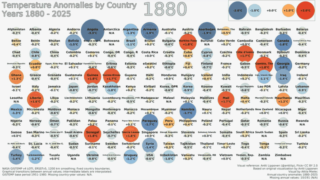

# Country temperature anomalies, 1880-2025

Reproduce an annual country dataset and a 1920 x 1080 bubble-chart animation
from a bundled NASA GISTEMP v4 snapshot. The board contains 191 fixed country
slots; anomalies are relative to **1951-1980**, in degrees Celsius.

<p align="center">
  <a href="results/temperature-anomalies-gistemp-1880-2025-preview.mp4">
    
  </a>
</p>

**Smaller video:** [Watch the complete 1880-2025 animation](results/temperature-anomalies-gistemp-1880-2025-preview.mp4)
(720p H.264, 15 fps, 62.4 seconds, 7.8 MB).

**Full-quality video:** [Download the 1080p video](https://github.com/Attila121/Temperature-Anomalies/raw/refs/heads/main/results/temperature-anomalies-gistemp-1880-2025-smooth.mp4)
(1080p H.264, 30 fps, 62.4 seconds, 67.4 MB).
The original is also available [locally in results/](results/temperature-anomalies-gistemp-1880-2025-smooth.mp4).

The inline GIF is a compact 640 x 360, 2 fps preview of the full animation.
Use either MP4 for clearer labels and smoother motion, or view the
[2025 still frame](examples/frame-2025.png).

This folder is a standalone release candidate. It includes the input data,
derived annual CSV, finished video, calculation and rendering code, bundled fonts, tests and
file checksums. It has no dependency on the private experiment workspace.

## Set up

Use Python 3.11 or newer. The recorded calculation environment used Python
3.11.15 and the exact versions in `requirements.txt`.

Windows PowerShell, from this folder:

```powershell
python -m venv .venv
.\.venv\Scripts\Activate.ps1
python -m pip install -r requirements.txt
```

Linux/macOS, from this folder:

```sh
python3 -m venv .venv
. .venv/bin/activate
python -m pip install -r requirements.txt
```

Or create a Conda environment with `conda env create -f environment.yml`, then
`conda activate temperature-anomalies`. The Conda manifest also pins the three
Python packages used by the calculation. Video encoding additionally requires
an FFmpeg installation with the `libx264` encoder available on `PATH`, or an
explicit `--ffmpeg PATH`. No FFmpeg binary is distributed here.

## Reproduce

Check the bundled files and run the tests:

```sh
python verify_release.py
python -m unittest discover -s tests -v
```

Recalculate from the original gridded input:

```sh
python gistemp_data.py
```

This writes `output/country-anomalies-gistemp-1880-2025.csv`, its methodology
report (`.json`), monthly country values and coverage (`.monthly.npz`), and
country/grid overlap weights (`.weights.npz`). The bundled copy in
`data/derived/` remains available for comparison. Recalculation with the recorded
environment reproduces its CSV SHA-256; other numerical-library builds may
introduce rounding differences.

Render an annual frame from the bundled CSV:

```sh
python render_frame.py --csv data/derived/country-anomalies-gistemp-1880-2025.csv --years 2012 2013 2025
```

Create the complete animation:

```sh
python build_video.py
```

The default uses the bundled annual CSV after checking its checksum and the
input/geometry hashes. A missing or inconsistent export is recalculated into
`output/`. The video defaults to 1080p H.264, 30 fps, 0.4 seconds per year and
two-second opening/closing holds: **62.4 seconds**. Rendering can take several
minutes. `--workers 1` reduces memory use; `--transitions none` gives annual
steps, and `--transitions linear` uses constant-rate interpolation.

To render the freshly recalculated export instead:

```sh
python build_video.py --csv output/country-anomalies-gistemp-1880-2025.csv
```

Outputs default to this project's `output/` directory, even when a script is
called from another directory. User-supplied relative paths resolve against
the current working directory. Output JSON reports record project-relative
paths and external input filenames, rather than local account paths.

## Included files

| Path | Purpose |
| --- | --- |
| `data/raw/` | Exact NASA snapshot and Natural Earth country boundaries |
| `data/derived/` | 27,886 country-year rows and their methodology/provenance report |
| `gistemp_data.py`, `netcdf_reader.py` | Decode the grid and compute country means |
| `render_frame.py`, `build_video.py` | Render annual frames and smooth video |
| `project_paths.py` | Portable default paths and metadata paths |
| `reference_data.py`, `compare_frames.py` | Optional historical-table adapter and explicit image comparison |
| `assets/fonts/` | Unmodified DejaVu Sans fonts and their license |
| `examples/` | Animated README preview, public 2025 frame and its render metadata |
| `results/` | Full-quality 1880-2025 video and smaller 720p copy, included in the public release inventory |
| `tests/` | Calculation, input, rendering and animation checks |
| `release-manifest.json`, `verify_release.py` | SHA-256 integrity inventory and checker |

The historical-table adapter accepts an explicitly supplied file. The historical
table, screenshots, original third-party script, source video, landmask and
calibration results remain in the private workspace; they are unnecessary for
reproducing the NASA calculation. The separate landmask is unnecessary because
country/grid polygon intersections already supply the land-area weights.

## Interpretation

Read [METHODS.md](METHODS.md) for aggregation, coverage and fixed-boundary
conventions, and [data/README.md](data/README.md) for data fields and snapshots.
Missing annual values remain `N/A`. The annual mean requires 12 usable monthly
values. Colours saturate at +/-2 C; bubble sizes and labels retain the full
anomaly. Video transitions are graphical interpolation between annual values,
not additional observations.

The finished video in `results/` uses the bundled DejaVu fonts and includes
the credit "Visual by Attila Mielec". The numerical method and board order
are preserved.

## Attribution and later publication

Sources and their attribution are recorded in [THIRD_PARTY_NOTICES.md](THIRD_PARTY_NOTICES.md)
and the data README. NASA citation guidance: [GISTEMP v4](https://data.giss.nasa.gov/gistemp/).
Natural Earth source: [v5.1.2 country boundaries](https://github.com/nvkelso/natural-earth-vector/blob/v5.1.2/geojson/ne_10m_admin_0_countries.geojson).

Publish this folder's contents as the repository root. Its `.gitignore` excludes
temporary generated outputs, environments, caches, experiments and local credentials;
the finished video in `results/`, bundled inputs and annual data remain included.
Nothing has been published by this preparation.

A license for the project's own code has not been selected. Select one before
advertising an open-source release. Third-party data and font terms are recorded
separately; the font license must stay with the bundled font files.

If you intentionally edit a bundled file, update `release-manifest.json` with
the new byte size and SHA-256 after review. The verifier will report changed
files until the manifest is updated. Generated `output/` files are not part of
the bundled-file integrity inventory.
